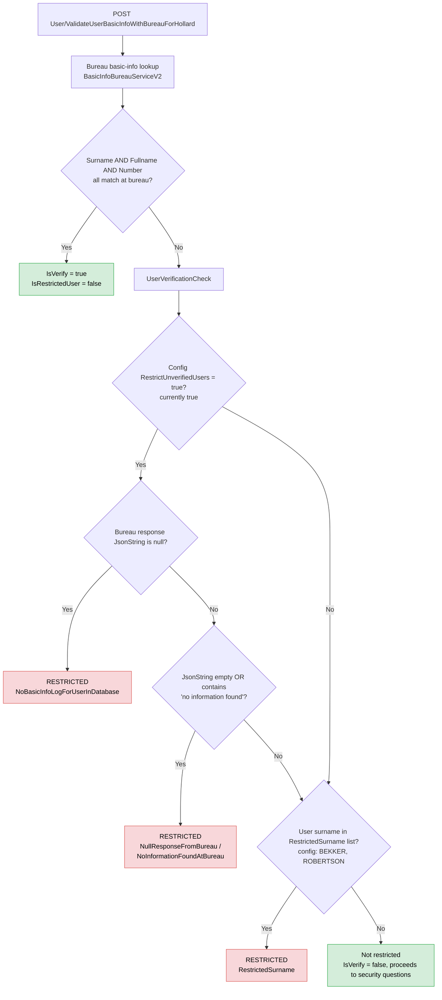
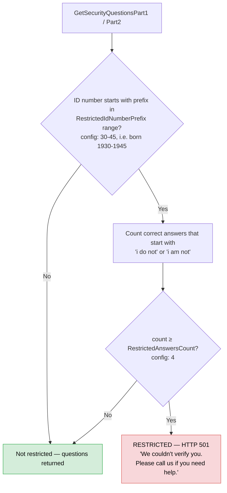

# Restricted User — Hollard API

A "restricted user" is a user the platform refuses to verify, shown the message *"We couldn't verify you. Please call us if you need help."* (HTTP 501). The logic lives in `cc.services/logic/Implementation/SecurityQuestionService.cs` and is driven by four config keys in `cc.api/appsettings.json`:

| Config key | Current value | Used by |
|---|---|---|
| `RestrictUnverifiedUsers` | `true` | `UserVerificationCheck` |
| `RestrictedSurname` | `BEKKER,ROBERTSON` | `UserVerificationCheck` |
| `RestrictedIdNumberPrefix` | `30-45` | `validateRestrictedIdNumberPrefix` |
| `RestrictedAnswersCount` | `4` | `validateRestrictedAnswers` |

There are two separate places a user gets restricted.

## 1. Bureau basic-info verification (registration)

Endpoint `User/ValidateUserBasicInfoWithBureauForHollard` (`cc.api/Controllers/UserController.cs`) sets `BasicInfoResponseModel.IsRestrictedUser`. If the bureau matches all three of surname, full name and phone number, the user is verified and never restricted. Only on a failed match does `UserVerificationCheck` run.

## 2. Restricted-answers check (security questions)

When fetching security questions (`GetSecurityQuestionsPart1` / `GetSecurityQuestionsPart2`), `validateRestrictedAnswers` can block the user with HTTP 501.

## Summary of the conditions

A user becomes **restricted** when any one of these holds:

1. **No bureau record** — bureau basic-info match failed and the bureau returned no data for them (null response, empty response, or "no information found"), while `RestrictUnverifiedUsers` is enabled.
2. **Blacklisted surname** — their surname is on the `RestrictedSurname` config list, checked after a failed bureau match regardless of the unverified-users flag.
3. **Elderly ID + evasive answers** — their SA ID number indicates birth year 1930–1945 (`RestrictedIdNumberPrefix`) **and** at least `RestrictedAnswersCount` (4) of their stored correct security-question answers are of the "I do not… / I am not…" type. This is a fraud heuristic: for high-risk identities, a profile whose correct answers are mostly "none of the above"-style is refused verification outright.

A user whose bureau match succeeds on all three fields is never restricted via paths 1 or 2 — those checks only run on a failed match. All restriction events are logged as `"User Restricted:"` with status code 501, so occurrences can be traced in Application Insights.